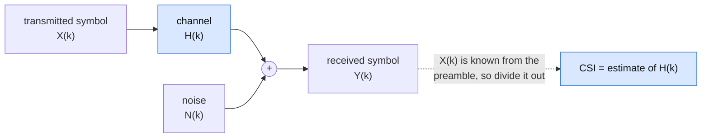
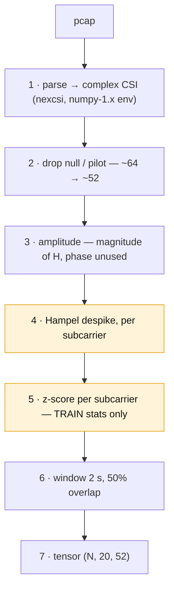
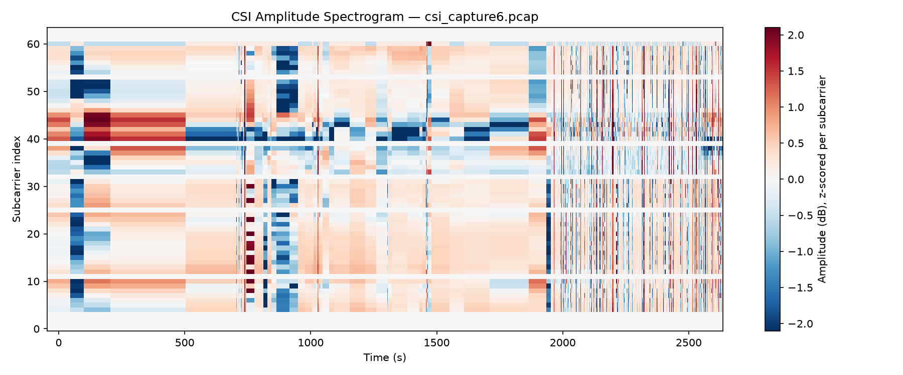

[Overview](index.md) · [Journey](journey.md) · [Installation](installation.md) · **CSI Fundamentals** · [Data Collection](data-collection.md) · [Signal Characterization](visualization.md) · [Models & Roadmap](models.md) · [GitHub](https://github.com/ananyasahani/rpi-csi-pose-sensing)
{: .site-nav }

# CSI Fundamentals & Data Processing

**What this covers / why it matters:** the theory behind Channel State Information,
how it is captured with `nexmon_csi`, and the preprocessing pipeline that turns
raw pcaps into model input. The general pipeline below lists every step you
*could* apply; this project uses a deliberately narrower fixed subset, and the
reasons are as important as the steps.

- [What is CSI?](#what-is-csi)
- [The math behind CSI](#the-math-behind-csi)
- [nexmon_csi capture format](#nexmon_csi-capture-format)
- [Preprocessing pipeline](#preprocessing-pipeline)
- [Visualization](#visualization)
- [Important commands](#important-commands)

## What is CSI?

Channel State Information describes how a wireless signal is altered as it travels
from transmitter to receiver — scattered, reflected, refracted, faded, and
attenuated by multipath propagation. Unlike RSSI, which gives a single scalar per
packet, CSI is a fine-grained, **per-subcarrier** measurement of the wireless
channel, which is what makes it useful for localization, motion and gesture
sensing, and human activity recognition.

In an OFDM system (802.11a/g/n/ac), the channel is divided into many narrow
orthogonal subcarriers. CSI is the estimated channel response for *each*
subcarrier, for *each* transmit–receive antenna pair — both amplitude and phase,
not just signal strength.

## The math behind CSI

### OFDM signal model



For a single subcarrier $k$, the frequency-domain received signal relates to the
transmitted signal through the channel:

$$Y(k) = H(k)\,X(k) + N(k)$$

where $X(k)$ is the transmitted symbol, $Y(k)$ the received symbol, $H(k)$ the
channel frequency response (this is the CSI), and $N(k)$ additive noise. Since the
transmitted symbol is known from the preamble / training fields, the receiver
estimates CSI as:

$$H(k) = \frac{Y(k)}{X(k)}$$

### Complex representation

$H(k)$ is a complex number, so it carries both magnitude and phase:

$$H(k) = \lvert H(k)\rvert \, e^{j\theta(k)}$$

$$\lvert H(k)\rvert = \sqrt{\operatorname{Re}(H(k))^2 + \operatorname{Im}(H(k))^2}
\qquad
\theta(k) = \operatorname{atan2}\big(\operatorname{Im}(H(k)),\ \operatorname{Re}(H(k))\big)$$

Amplitude tells you how much a subcarrier's signal was attenuated; phase tells you
how much it was delayed or shifted. Both vary over time as the environment
changes — for example, a person moving through the signal path.

### MIMO / multi-dimensional CSI

With multiple antennas and multiple packets over time, CSI becomes a tensor
$H[t, \text{tx}, \text{rx}, k]$ indexed by time, transmit antenna, receive antenna
and subcarrier. Most consumer chips supported by `nexmon_csi` (the Raspberry Pi
included) expose 1 transmit stream and 1–4 receive antennas, so in practice you
work with a $[\text{time}, \text{subcarrier}]$ amplitude/phase matrix per
antenna/core.

### Subcarrier counts by bandwidth

`nexmon_csi` reports CSI for every subcarrier in the configured channel bandwidth,
including null and pilot subcarriers that must be excluded during preprocessing:

| Bandwidth | Total subcarriers | Notes |
|---|---|---|
| 20 MHz | 64 | fewer null/pilot to strip |
| 40 MHz | 128 | ~14 null, 6 pilot |
| 80 MHz | 256 | most commonly used for finer resolution |

This project runs at **20 MHz / channel 11**, so 64 subcarriers, roughly 52 usable
after null and pilot removal.

## nexmon_csi capture format

`nexmon_csi` patches the WiFi firmware so that every matching frame's CSI is pushed
out as a **UDP packet** (source `10.10.10.10`, destined to `255.255.255.255`, port
`5500`), which you capture into a `.pcap` file. Each packet payload contains, in
order: magic bytes, RSSI, frame-control byte, source MAC, sequence number,
core / spatial-stream and chanspec fields, chip version, and finally the raw CSI
samples as **interleaved Int16 real/imaginary pairs** (one complex value per
subcarrier).

A Python decoder (e.g. [`nexcsi`](https://github.com/nexmonster/nexcsi)) reads this
directly into a structured NumPy array, exposing fields like `rssi`, `fctl`,
`mac`, `seq` and `csi`.

## Preprocessing pipeline

### The general pipeline

These are the steps available to any `nexmon_csi` project. Which of them you use
depends on your hardware and your task.

1. **Capture** raw CSI as a `.pcap` file with `tcpdump` while the firmware is
   configured with `nexutil` / `makecsiparams`.
2. **Parse** the pcap into a structured array (`nexcsi`, `csiread` or `CSIKit`),
   pulling out the raw Int16 CSI payload per packet.
3. **Reconstruct complex CSI** by pairing each interleaved (real, imag) pair into a
   complex number per subcarrier: `H = real + 1j*imag`.
4. **Strip null and pilot subcarriers** — these carry no usable channel
   information and otherwise show up as zeros/outliers.
5. **Extract amplitude and phase** per subcarrier, per packet, using the formulas
   above.
6. **Unwrap and sanitize phase** — raw phase wraps at $\pm\pi$ and includes a
   random timing/frequency offset per packet. Use `np.unwrap()` across subcarriers,
   then remove the linear phase trend with a linear fit subtraction so only the
   true channel phase remains.
7. **Remove outliers** in the amplitude stream — a Hampel or rolling-median filter
   handles the occasional corrupted packet or spike.
8. **Denoise / smooth** — a low-pass (e.g. Butterworth) filter across time, or PCA
   across subcarriers, reduces high-frequency noise while preserving the
   motion signal.
9. **Normalize** amplitude (min-max or z-score per subcarrier) if the data feeds a
   machine-learning model.

### What this project runs



Three things about this are not negotiable, and each is a place CSI projects
commonly go wrong:

- **Step 4, the Hampel filter, is the most important cleaning step on this
  hardware.** The chip's automatic gain control rescales the whole signal at once,
  producing sharp amplitude jumps that look exactly like a person walking past. A
  Hampel (median + MAD-threshold) filter per subcarrier removes them. An AGC step
  is also distinguishable by eye: it moves *every* subcarrier by the same factor,
  whereas real motion is frequency-selective and only disturbs some.
- **Step 5 must not leak.** Compute the per-subcarrier mean and standard deviation
  on the *training split only*, then apply those same numbers to validation and
  test. Computing statistics over the whole dataset, or per-file, silently leaks
  test information and inflates every result. Guard this one — it fails quietly.
- **Split before you window, by whole session.** Windows from one session are
  nearly identical to each other, so a random window-level split puts
  near-duplicates on both sides and produces a meaningless accuracy. Assign
  entire sessions to a split, holding out at least one day and one person never
  seen in training, and only then window within each split. See
  [Data Collection](data-collection.md).

Steps 6 and 8 of the general list are intentionally skipped: **phase is not used**
because it carries a random per-boot offset on the `bcm43455c0` that we have no way
to calibrate out, and low-pass smoothing is left out because the windowing and the
model already handle temporal structure. Note that `nexcsi` pins `numpy<2.0`, so
step 1 typically runs in its own environment — parse to `.npy` there, and do
everything downstream in the main environment.

The locked pipeline and the rationale behind each step live in
[`context/03-preprocessing.md`](https://github.com/ananyasahani/rpi-csi-pose-sensing/blob/main/context/03-preprocessing.md);
the locked capture parameters are in
[`CLAUDE.md`](https://github.com/ananyasahani/rpi-csi-pose-sensing/blob/main/CLAUDE.md).

### Sanity checks worth running every time

- Print the parsed shape and confirm the subcarrier count matches the bandwidth
  (~64 raw at 20 MHz). A wrong count means the wrong `nexcsi` device string or a
  corrupt file.
- Plot one amplitude heatmap per class and confirm the quiet class looks flat and
  the walking class shows bursts. If it does not, the problem is the data, not the
  model — stop and fix the rig.
- Confirm there are no NaNs after the z-score: a zero-variance subcarrier divides
  by ~0, so keep the `+1e-8` guard.

## Visualization

The fastest view for inspecting CSI is the **amplitude heatmap** — time on the
x-axis, subcarrier index on the y-axis, colour as amplitude:

<figure>
  
  <figcaption>
    One of our own captures (<code>csi_capture6.pcap</code>). Each subcarrier is
    z-scored to its own mean and standard deviation, because raw amplitude varies
    enormously from one subcarrier to the next (frequency-selective fading) and
    that static variation would drown out the smaller time-varying changes caused
    by motion. A whole vertical column shifting colour at once is an AGC step, not
    a person; frequency-selective texture that only touches some subcarriers is a
    real channel disturbance; the noisy right-hand edge is a stretch of degraded
    capture. The <a href="visualization.md">Signal Characterization</a> page walks
    through reading plots like this properly.
  </figcaption>
</figure>

```python
import matplotlib.pyplot as plt

# amplitude: shape [n_packets, n_subcarriers]
plt.imshow(amplitude.T, aspect="auto", cmap="viridis",
           extent=[0, amplitude.shape[0], 0, amplitude.shape[1]])
plt.xlabel("Packet index (time)")
plt.ylabel("Subcarrier index")
plt.colorbar(label="Amplitude")
plt.title("CSI Amplitude Heatmap")
plt.show()
```

The scripts that produce these figures — `notebooks/datasets/csi_spectrogram.py`
(single amplitude heatmap) and `notebooks/four_plot_sequence.py` (the four-plot
sanity sequence) — are in the repository.

## Important commands

### Generate CSI extraction parameters

```bash
# channel 11, 20 MHz bandwidth, core 0, spatial stream 0, filtered to one MAC
makecsiparams -c 11/20 -C 1 -N 1 -m <TRANSMITTER_WIFI_MAC>

# full option list
makecsiparams -h
```

### Configure the firmware extractor (bcm43455c0 / Pi-class chips)

```bash
sudo rfkill unblock all
sudo ip link set wlan0 up
sudo nexutil -Iwlan0 -s500 -b -l34 -v<base64-params-from-makecsiparams>
sudo nexutil -Iwlan0 -m1
```

### Capture CSI to a pcap file

```bash
# Live view
sudo tcpdump -i wlan0 dst port 5500

# Save N packets to disk
sudo tcpdump -i wlan0 dst port 5500 -vv -w output.pcap -c 1000
```

### Decode captured CSI in Python

```python
from nexcsi import decoder

device = "raspberrypi"                              # must match the capture chip
samples = decoder(device).read_pcap("output.pcap")
csi = decoder(device).unpack(samples["csi"])        # complex64 array
rssi = samples["rssi"]
```

---

*Next: the [Signal Characterization](visualization.md) page for the visual sanity
checks, or the [Installation](installation.md) page for the one-time firmware
build.*
