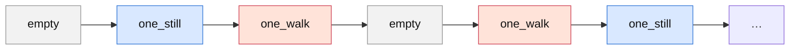
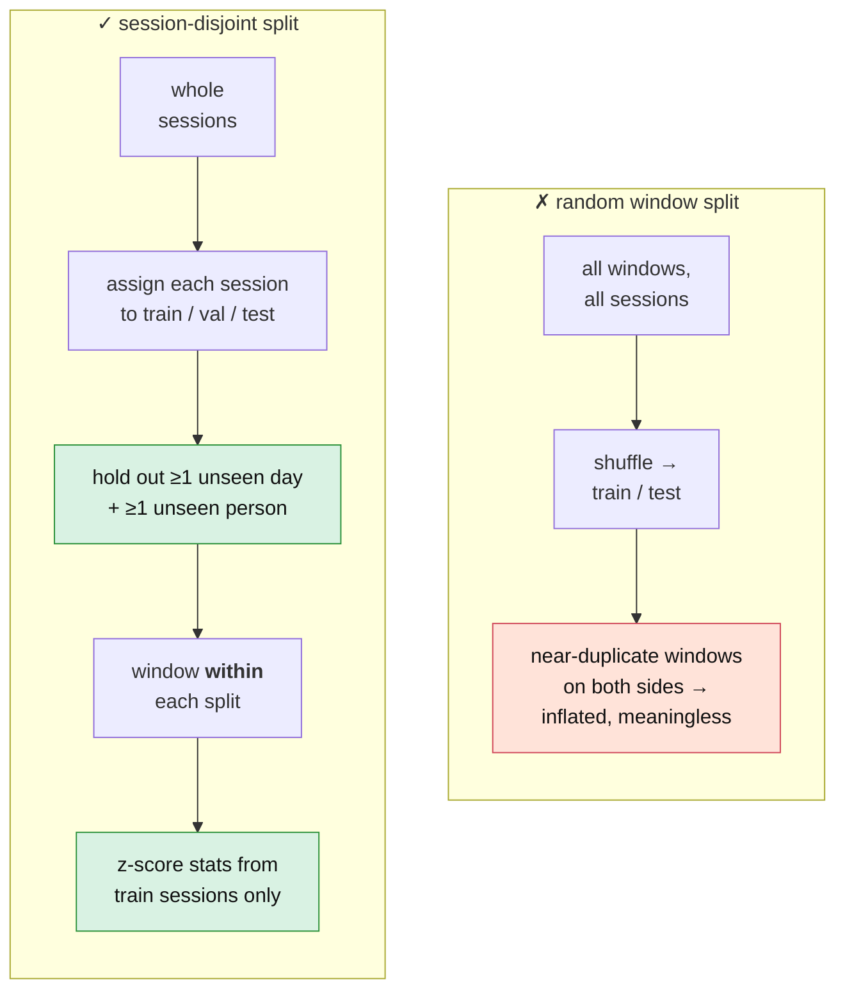

[Overview](index.md) · [Journey](journey.md) · [Installation](installation.md) · [CSI Fundamentals](csi_preprocessing.md) · **Data Collection** · [Signal Characterization](visualization.md) · [Models & Roadmap](models.md) · [GitHub](https://github.com/ananyasahani/rpi-csi-pose-sensing)
{: .site-nav }

# Data Collection

**What this covers / why it matters:** how to capture a clean, labelled,
generalizable dataset. Custom data means we own the labels — and sloppy labelling
is the top way WiFi-sensing projects fail. The method here makes labels automatic
and the train/test splits honest.

## Why no camera is needed

This project does **classification**, not pose estimation. The label is a category
(`walk`), and we control what happens during capture. If a script says "walk for
60 s", every packet in that block is labelled `walk` by construction — the
instruction timing *is* the ground truth. A camera would only be needed to recover
joint positions (pose), which is out of scope.

## Labelling method: scripted timed sessions

A capture script announces each block (countdown / beep), then records a fixed
duration, saving one cleanly-named pcap per block. You comply with the
instruction; the block's label is fixed. Reproducible, no manual annotation.

**Filename convention:** `{class}_{day}_{person}_{index}.pcap` — for example
`one_walk_day2_p1_003.pcap`. This encodes the label *and* the session / day /
person needed for honest splits.

One ~6-minute session cycles the classes in ~60 s blocks, and the order is varied
between sessions. At ~10 Hz a 60 s block is roughly 600 packets — about 59
labelled windows per block at 2 s / 50% overlap.

## Test scenarios, by tier

Do them in order — do not start a tier until the previous one clearly separates.

| Tier | Scenarios | Notes |
|---|---|---|
| **1 — core** | `empty`, `one_still`, `one_walk` | Collect and validate first. `empty` = nobody in the room, doorway clear. `one_still` = one person motionless in the sensing zone. `one_walk` = one person walking continuously along the Tx–Rx line. |
| **2 — multi-person** | `two_still`, `two_walk`, `three_still`, `three_walk` | Only after Tier 1 separates. |
| **3 — exploratory** | `fall` (onto a mat), `mixed` (realistic occupancy) | Report honestly; don't stake the project on these. |

**Reality check on people-counting.** Distinguishing 2 vs 3 people on
single-antenna 20 MHz CSI is genuinely hard — more people means more variance, but
the mapping isn't clean. The solid contribution is framed as presence + coarse
activity; counting is an exploratory extension.

## Transmitter / receiver placement

The direct Tx–Rx path dominates the signal, and a body perturbs it most when it
crosses the Fresnel zones around that direct line. So *where* a person is matters
more than whether they are simply "in the room".

<figure>
<svg viewBox="0 0 640 300" xmlns="http://www.w3.org/2000/svg" role="img"
     aria-label="Top-down view: transmitter and receiver 3 metres apart at torso height, with the first Fresnel zone as an ellipse around the direct line. A person crossing the line perturbs the signal strongly; a person in the far corner barely does.">
  <rect x="8" y="8" width="624" height="284" fill="none" stroke="#bbb" stroke-width="2"/>
  <!-- Fresnel ellipse -->
  <ellipse cx="320" cy="150" rx="240" ry="60" fill="#3b7dd8" fill-opacity="0.10"
           stroke="#3b7dd8" stroke-dasharray="4 4"/>
  <!-- direct line -->
  <line x1="90" y1="150" x2="550" y2="150" stroke="#333" stroke-dasharray="6 5" stroke-width="2"/>
  <text x="320" y="140" text-anchor="middle" font-size="13" fill="#333">direct path — 3 m, torso height (~1.1 m)</text>
  <text x="320" y="220" text-anchor="middle" font-size="12" fill="#3b7dd8">first Fresnel zone</text>
  <!-- Tx -->
  <circle cx="90" cy="150" r="10" fill="#d1495b"/>
  <text x="90" y="180" text-anchor="middle" font-size="13" fill="#d1495b">Tx</text>
  <!-- Rx -->
  <circle cx="550" cy="150" r="10" fill="#3b7dd8"/>
  <text x="550" y="180" text-anchor="middle" font-size="13" fill="#3b7dd8">Rx</text>
  <!-- person crossing -->
  <circle cx="320" cy="150" r="9" fill="#2e933c"/>
  <text x="320" y="112" text-anchor="middle" font-size="12" fill="#2e933c">crossing the line — strong perturbation</text>
  <!-- person in corner -->
  <circle cx="590" cy="270" r="9" fill="#999"/>
  <text x="560" y="286" text-anchor="end" font-size="12" fill="#999">far corner — barely visible</text>
</svg>
<figcaption>
  Canonical placement for the main dataset. A person standing in a far corner is
  "in the room" but hardly disturbs the direct path; if your signal looks weak,
  have someone walk straight across the Tx–Rx line before concluding the rig
  doesn't work.
</figcaption>
</figure>

**Canonical placement (use for the main dataset):**

- Tx–Rx **3 m apart** (3–4 m is fine).
- Both at **torso height (~1–1.3 m)** on stands — not on the floor, which weakens
  the body reflection.
- **Clear line of sight**; the activity area on or near that line.
- **Floor-tape both positions** and reproduce them every session — placement drift
  silently corrupts the dataset.

**Topology constraint:** the transmitter Pi must stay associated to the hotspot to
keep pinging, so its placement is bounded by hotspot range. If you push distance
and captures thin out, check `iw dev wlan0 link` on the transmitter before blaming
placement.

## Vary across sessions, not within a block

Generalization comes from variation *between* sessions:

- different **days and times of day** (multipath drifts);
- different **people** (even 2–3 helps a lot);
- different **still-positions** and **walk-paths**;
- capture `empty` **every session** — the empty-room fingerprint drifts, so you
  need empties from every condition, not one canonical empty.

## The rule that makes results trustworthy: session-disjoint splits

Never split train/test by random window — windows from the same session are nearly
identical and leak. Split by **whole session**, and hold out **at least one day and
one person never seen in training**.

This mirrors the leave-one-environment-out / subject-disjoint protocols used by the
strongest papers in this area. It is non-negotiable; a random split produces
inflated, meaningless accuracy.

## How much data

- **Labelled:** roughly 15–25 sessions, ≥3 days, ≥2 people — on the order of a few
  thousand labelled windows. Modest, but the self-supervised pretraining
  compensates.
- **Unlabelled (for pretraining):** several long (10–30 min) passive recordings of
  the room in normal use. Collect generously — it's free and it's what the
  self-supervised phase feeds on.

## Placement and channel studies

Two cheap, self-contained sub-studies that need no new labelling machinery:

- **Placement:** run only `empty` vs `one_walk` across distances (2/3/4/5 m),
  heights (floor / torso / high) and person-position (on-line / 1 m off / far
  corner). Measure detection accuracy → an "optimal geometry" result.
- **Channel:** scan channels for interference, pick low-traffic ones, compare
  capture stability and accuracy → "channel selection guidance".

Run the full scenario list at the one canonical placement (main dataset), and only
the two-class `empty` / `walk` case across placements and channels (study). That
keeps the study from exploding into hundreds of sessions.

---

*The full protocol, including the Week 0 pilot gate, is in
[`context/02-data-collection.md`](https://github.com/ananyasahani/rpi-csi-pose-sensing/blob/main/context/02-data-collection.md).
Locked parameters (channel, sampling rate, window) are in
[`CLAUDE.md`](https://github.com/ananyasahani/rpi-csi-pose-sensing/blob/main/CLAUDE.md).*
