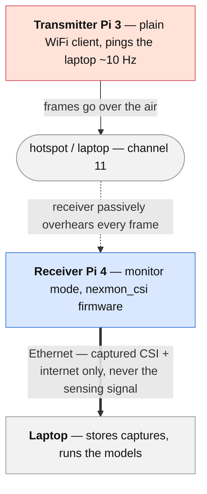
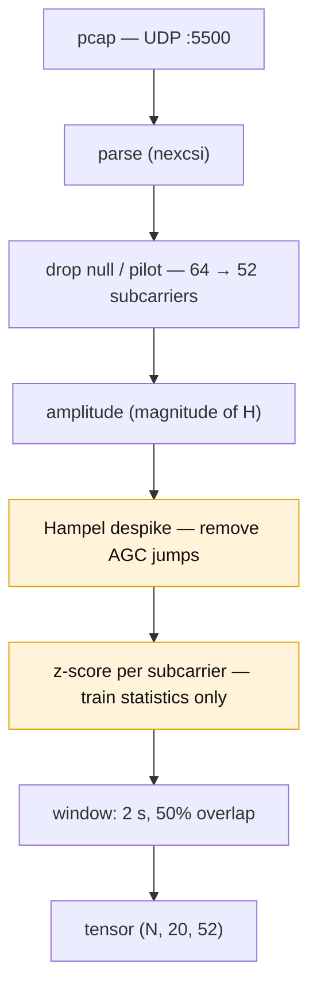

**Overview** · [Journey](journey.md) · [Installation](installation.md) · [CSI Fundamentals](csi_preprocessing.md) · [Data Collection](data-collection.md) · [Signal Characterization](visualization.md) · [Models & Roadmap](models.md) · [GitHub](https://github.com/ananyasahani/rpi-csi-pose-sensing)
{: .site-nav }

# WiFi CSI Human Sensing

Sensing people through the WiFi they are already standing in. A Raspberry Pi with
patched [nexmon_csi](https://github.com/seemoo-lab/nexmon_csi) firmware passively
measures how human bodies perturb the wireless channel, and learns to tell
**empty** from **someone standing still** from **someone walking** — no camera,
works in the dark, works through some occlusion.

The headline experiment: a **Mamba sequence model, pretrained self-supervised on
unlabelled ambient CSI**, then fine-tuned on a small labelled set. The open
question it answers is whether the label-efficiency gains reported on expensive
multi-antenna rigs also hold on **cheap, single-antenna hardware**.

> **A note on the name.** The repository and this site are hosted under
> `rpi-csi-pose-sensing`, which reflects where the project started. The confirmed
> task is *classification* — presence and coarse activity — **not** 3D pose
> estimation. Pose is future work (see [Models & Roadmap](models.md)). The URLs
> are unchanged so existing links keep working.

## How the rig works

Two Raspberry Pis split the job. One **transmits** ordinary traffic; the other
**listens** to how that traffic arrives.

The transmitter sends nothing special — just ICMP pings, so there is a steady,
known stream of frames in the air. The receiver never associates to anything; in
monitor mode it computes a **channel estimate (CSI)** for every frame it hears.
When a body moves through the space between them, that estimate changes. The
Ethernet cable only carries finished captures back to the laptop — it is not part
of the sensing path.

Four hardware arrangements were tried before this one stuck; that story is in
[the setup journey](journey.md).

## Why WiFi instead of a camera

Camera-based sensing works well but needs line of sight, fails in the dark, and
puts a recording device in a private space. CSI reflects only how the signal was
distorted on its way through the room — enough to infer presence and motion,
without a camera anywhere.

Because the task is **classification, not pose**, no camera is needed for the
*labels* either. Capture runs from a timed script that announces each activity
block, so the instruction timing *is* the ground truth. See
[Data Collection](data-collection.md).

## What the raw signal looks like

<figure>
  
  <figcaption>
    Amplitude of one of our own captures (<code>csi_capture6.pcap</code>), each
    subcarrier z-scored to its own mean so the <em>changes over time</em> carry
    the contrast. Red/blue bands that move are channel activity; a whole vertical
    column shifting at once is the chip's automatic gain control, not a person;
    the ragged right-hand edge is a stretch of poor capture. Reading plots like
    this is covered on the <a href="visualization.md">Signal Characterization</a>
    page.
  </figcaption>
</figure>

## From pcap to model input

Every capture goes through the same fixed pipeline. The order is not negotiable —
each step is a place CSI projects commonly go wrong.

The **Hampel filter** is the step that matters most on this hardware: the chip's
automatic gain control rescales the whole signal at once, producing sharp jumps
that look exactly like motion. Normalisation statistics come from the **training
split alone**, and train/test splits are made by **whole session** — never by
random window, which leaks near-identical windows across the split and inflates
every number. Full rationale on the [CSI Fundamentals](csi_preprocessing.md) and
[Data Collection](data-collection.md) pages.

## Models

Built in order, so each one produces a number the next has to beat:

1. **Threshold baseline** — rolling variance on the first principal component. No
   training; the naive number every learned model must clear.
2. **RandomForest / SVM** on hand features (per-subcarrier variance, low-band
   spectral energy, top PCA components).
3. **Small CNN** over the window tensor.
4. **Mamba** sequence model — linear-time over the CSI window.
5. **Mamba + masked-reconstruction self-supervised pretraining** — the headline.

The reasoning behind each, and the experiments that turn this into a paper, are on
the [Models & Roadmap](models.md) page.

## Roadmap in brief

- **Phase 0 — pilot (current).** One scripted `empty`/`still`/`walk` session, run
  through preprocessing and the four-plot visual check, to confirm the classes
  actually separate on this hardware before bulk collection.
- **Phase 1 — the core work.** 15–25 labelled sessions plus long unlabelled
  ambient recordings; all five models on session-disjoint splits; a
  label-efficiency curve, a masking ablation, a placement study and a channel
  study.
- **Later, one at a time.** Through-wall robustness, multi-person counting,
  camera-labelled 3D pose, ESP32 hardware.

## Status

Actively in progress. Firmware patching, monitor mode and CSI capture are
confirmed working; the spectrogram and four-plot tooling is drafted. Current
focus: the Phase 0 pilot and the labelled collection that follows it.

## Team

Ananya Sahani · Sandeep Balaji · Hemesh Kukreja

## Publications

*None yet — this section will be updated if the project results in a paper or
writeup.*

---

*The internal planning documents (`context/01`–`06`) live in the
[GitHub repository](https://github.com/ananyasahani/rpi-csi-pose-sensing/tree/main/context);
the locked parameters and standing rationale are in
[`CLAUDE.md`](https://github.com/ananyasahani/rpi-csi-pose-sensing/blob/main/CLAUDE.md).*
