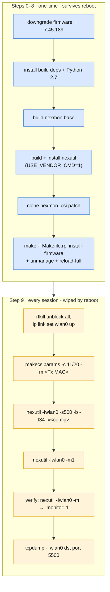

[Overview](index.md) · [Journey](journey.md) · **Installation** · [CSI Fundamentals](csi_preprocessing.md) · [Data Collection](data-collection.md) · [Signal Characterization](visualization.md) · [Models & Roadmap](models.md) · [GitHub](https://github.com/ananyasahani/rpi-csi-pose-sensing)
{: .site-nav }

# Nexmon CSI — Installation Guide

> The `nexmon_csi` installation method used in this project (the `Makefile.rpi`
> build, tested on **Raspberry Pi 4 Model B** and **Raspberry Pi 5**) is based on
> the solution shared by [jlinktu](https://github.com/jlinktu) in
> [nexmon_csi Discussion #395](https://github.com/seemoo-lab/nexmon_csi/discussions/395),
> on Raspberry Pi OS Lite 64-bit (Trixie, November 2025). This guide combines the
> firmware downgrade step with the full Nexmon CSI build.

## What this does

Nexmon CSI lets your Raspberry Pi's WiFi chip report **Channel State Information
(CSI)** — raw signal measurements from every received WiFi packet. This requires:

1. Replacing the default WiFi firmware with an older patched version.
2. Building and installing the Nexmon CSI patch on top of that firmware.

## One-time vs every-session

The build survives a reboot; the runtime capture configuration does not. Keep the
two apart in your head:



The project's full per-session checklist — including starting the transmitter and
confirming packets are actually flowing — is
[`context/01-installation-setup.md`](https://github.com/ananyasahani/rpi-csi-pose-sensing/blob/main/context/01-installation-setup.md).

## Prerequisites

- Raspberry Pi 4B or 5 with Raspberry Pi OS Lite 64-bit (Trixie)
- Internet access via Ethernet (WiFi will go down during setup)
- SSH access or a keyboard/monitor connected

## Step 0 — Raspberry Pi 5 only: switch to the non-16K kernel

> **Skip this if you are on a Raspberry Pi 4.**

The default Pi 5 kernel uses 16K memory pages, which breaks the Nexmon build
tools. Switch to the standard 4K-page kernel first:

```bash
sudo echo 'kernel=kernel8.img' >> /boot/firmware/config.txt
sudo reboot
```

Reconnect after reboot before continuing.

## Step 1 — Downgrade the WiFi firmware

The Nexmon CSI patch targets firmware version `7.45.189`. Download it and replace
the current firmware:

```bash
cd ~

# Download the patched firmware binary
curl -LO https://raw.githubusercontent.com/seemoo-lab/nexmon/master/firmwares/bcm43455c0/7_45_189/brcmfmac43455-sdio.bin

# Back up the current firmware (so you can restore it later)
sudo cp /lib/firmware/brcm/brcmfmac43455-sdio.bin ~/brcmfmac43455-sdio.bin.backup

# Install the older firmware
sudo cp brcmfmac43455-sdio.bin /lib/firmware/brcm/brcmfmac43455-sdio.bin

# Reboot so the new firmware is loaded
sudo reboot
```

Reconnect after reboot.

## Step 2 — Update the system and install dependencies

```bash
sudo apt update
sudo apt full-upgrade -y
sudo apt install -y \
  git libgmp3-dev gawk qpdf bison flex make autoconf libtool texinfo xxd \
  libnl-3-dev libnl-genl-3-dev bc libssl-dev tcpdump
```

## Step 3 — Raspberry Pi 5 only: install 32-bit compatibility libraries

> **Skip this if you are on a Raspberry Pi 4.**

The Nexmon build tools include some 32-bit (armhf) binaries. On a 64-bit-only
system you need to add 32-bit library support:

```bash
sudo dpkg --add-architecture armhf
sudo apt update
sudo apt install -y \
  libc6:armhf libisl23:armhf libmpfr6:armhf libmpc3:armhf libstdc++6:armhf

# Create symlinks for older library names the build tools expect
sudo ln -s /usr/lib/arm-linux-gnueabihf/libisl.so.23 /usr/lib/arm-linux-gnueabihf/libisl.so.10
sudo ln -s /usr/lib/arm-linux-gnueabihf/libmpfr.so.6 /usr/lib/arm-linux-gnueabihf/libmpfr.so.4
```

## Step 4 — Install Python 2.7

One of the Nexmon build tools requires Python 2.7, which is no longer in current
Debian repositories. Pull it from the Debian Stretch archive:

```bash
# Temporarily add the old Debian Stretch repo
sudo cp /etc/apt/sources.list /tmp/
echo 'deb http://archive.debian.org/debian/ stretch contrib main non-free' | sudo tee -a /etc/apt/sources.list

sudo apt update
sudo apt install -y python2.7

# Remove the old repo and restore the original sources
sudo mv /tmp/sources.list /etc/apt/sources.list
sudo apt update
```

## Step 5 — Clone and build the Nexmon base

```bash
cd ~
git clone --depth=1 https://github.com/seemoo-lab/nexmon.git
cd nexmon

# Set up the build environment variables
source setup_env.sh

# Fix the b43-beautifier script to use Python 2.7
sed -i '1 s/$/2.7/' $NEXMON_ROOT/buildtools/b43-v3/debug/b43-beautifier

# Build the base tools
make
```

> **Note:** `source setup_env.sh` sets environment variables (`$NEXMON_ROOT`,
> compiler paths, etc.) that the rest of the build depends on. If you open a new
> terminal later, run `source ~/nexmon/setup_env.sh` again before running any
> `make` commands.

## Step 6 — Build and install nexutil

`nexutil` is the command-line tool you'll use to configure CSI extraction and
switch the WiFi interface into monitor mode.

```bash
cd $NEXMON_ROOT/utilities/nexutil

# Build and install (USE_VENDOR_CMD=1 is required — without it the driver rejects commands)
sudo -E make install USE_VENDOR_CMD=1

# Give nexutil permission to manage network interfaces without sudo every time
sudo setcap cap_net_admin+ep /usr/bin/nexutil
```

## Step 7 — Clone the Nexmon CSI patch

```bash
cd $NEXMON_ROOT/patches/bcm43455c0/7_45_189
git clone --depth=1 https://github.com/seemoo-lab/nexmon_csi.git
cd nexmon_csi
```

## Step 8 — Build and install the patched firmware

This installs the CSI-capable firmware using the system's `update-alternatives`
mechanism, which makes it easy to switch back to the default firmware later.

```bash
# Compile and install the patched firmware
make -f Makefile.rpi install-firmware

# Tell NetworkManager to leave the wlan0 interface alone
make -f Makefile.rpi unmanage

# Reload the WiFi driver to apply the new firmware
make -f Makefile.rpi reload-full
```

Confirm the CSI firmware is the active alternative:

```bash
sudo update-alternatives --config cyfmac43455-sdio.bin
# select the entry under .../nexmon/... (marked *). Press Enter to keep it.
```

## Step 9 — Start capturing CSI

> **This step is not one-time.** Everything above survives a reboot (the patched
> firmware is registered with `update-alternatives`, so it stays selected), but
> the *runtime* configuration below does not. Monitor mode and the CSI extractor
> config are wiped on every reboot and must be re-applied each session.

**Bring the interface up.** After a boot the radio may be RF-killed or down:

```bash
sudo rfkill unblock all
sudo ip link set wlan0 up
```

**Configure the CSI extractor.** Generate your config string with the
`makecsiparams` tool (included in the nexmon_csi repo), then apply it. Filtering to
a single transmitter MAC with `-m` is what makes captures clean and reproducible —
every sample then comes from one known source:

```bash
# from the nexmon_csi directory; the tool may not be on PATH
./utils/makecsiparams/makecsiparams -c 11/20 -C 1 -N 1 -m <TRANSMITTER_WIFI_MAC>
#   -> copy the printed base64 string

sudo nexutil -Iwlan0 -s500 -b -l34 -v<your-config-string>
```

**Enable monitor mode, and verify it took:**

```bash
sudo nexutil -Iwlan0 -m1
sudo nexutil -Iwlan0 -m      # must print "monitor: 1" — do NOT trust iwconfig here
```

**Capture CSI packets** (they arrive as UDP on port 5500):

```bash
sudo tcpdump -i wlan0 dst port 5500
```

Packets should scroll. If nothing appears, run `sudo tcpdump -i wlan0` with no
filter: traffic but nothing on port 5500 means the `nexutil` config did not take,
while total silence means no frames on your configured channel are reaching the
radio at all.

## Restoring the default WiFi

To go back to normal WiFi (CSI extraction will stop working):

```bash
# From inside the nexmon_csi directory
make -f Makefile.rpi restore-wifi
```

Or switch firmware manually:

```bash
sudo update-alternatives --config cyfmac43455-sdio.bin
# Then reload the driver:
make -f Makefile.rpi reload-full
```

To restore from the backup you made in Step 1:

```bash
sudo cp ~/brcmfmac43455-sdio.bin.backup /lib/firmware/brcm/brcmfmac43455-sdio.bin
sudo reboot
```

## Quick reference — commands you'll use repeatedly

| What | Command |
|---|---|
| Re-activate CSI after reboot | `source ~/nexmon/setup_env.sh` → `nexutil -Iwlan0 -s500 -b -l34 -v<config>` → `nexutil -Iwlan0 -m1` |
| Verify monitor mode | `sudo nexutil -Iwlan0 -m` (must print `monitor: 1`) |
| Capture packets | `sudo tcpdump -i wlan0 dst port 5500` |
| Reload driver | `make -f Makefile.rpi reload-full` (from nexmon_csi dir) |
| Switch firmware | `sudo update-alternatives --config cyfmac43455-sdio.bin` |
| Restore WiFi | `make -f Makefile.rpi restore-wifi` |

---

*For *why* this particular OS / kernel / firmware combination was chosen — and the
ones that failed — see the [Hardware Setup Journey](journey.md).*
