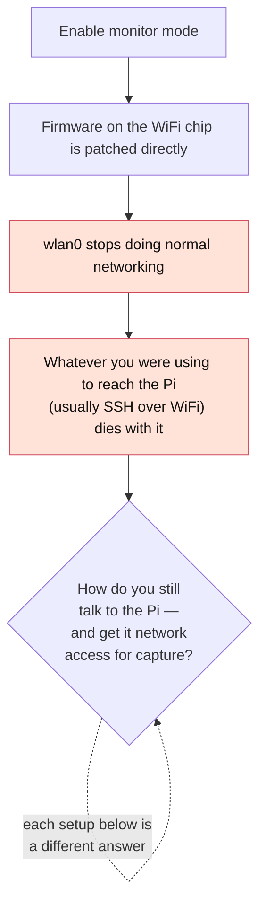
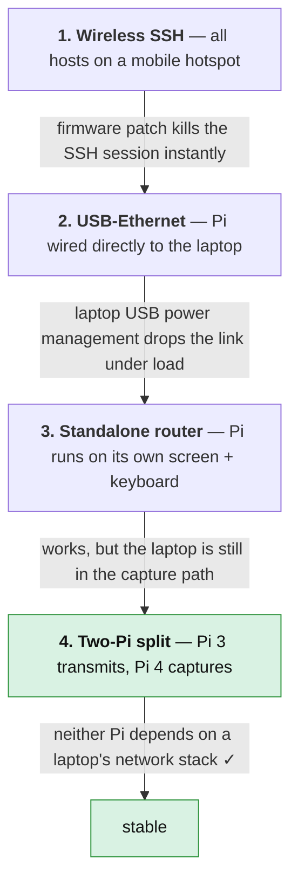

[Overview](index.md) · **Journey** · [Installation](installation.md) · [CSI Fundamentals](csi_preprocessing.md) · [Data Collection](data-collection.md) · [Signal Characterization](visualization.md) · [Models & Roadmap](models.md) · [GitHub](https://github.com/ananyasahani/rpi-csi-pose-sensing)
{: .site-nav }

# Hardware Setup Journey

**What this covers / why it matters:** Four hardware and network arrangements were
worked through before `nexmon_csi` capture became stable, plus a longer fight to
line up OS, kernel and firmware versions. Every failed iteration traces to the
same root cause, so understanding it once explains all of them.

## The one problem underneath all of it



Once `wlan0` is gone, SSH over WiFi goes with it. Every arrangement below is a
different answer to: **once `wlan0` is gone, how do you still reach the Pi, and
how does the Pi still get a network path for capture?**

## The four arrangements



### Setup 1: Mobile hotspot (wireless SSH)

All hosts communicated wirelessly over a mobile hotspot, with Trixie OS flashed to
the SD card. `nexmon_csi` was installed and compiled as-is.

**Failure point:** patching the firmware to enable monitor mode killed the `wlan0`
link — and with it, the SSH session. A physical connection turned out to be
non-negotiable once the firmware is patched.

### Setup 2: USB-to-Ethernet

To get around the `wlan0` problem, the Pi was connected directly to a laptop via a
USB-to-Ethernet adapter, giving it a network path outside of WiFi entirely.

**Failure point:** the connection was flaky rather than broken. Laptop USB ports
manage power output tightly, and the Ethernet link would drop during anything
resource-intensive — cloning large repositories, for example.

> `tmux` sessions can keep work alive through these drops, but that's a
> workaround, not a fix. A more stable hardware configuration was still needed.

### Setup 3: Standalone with a router

This setup removed the laptop from the Pi's network path altogether. The Pi runs
independently with its own monitor and keyboard, monitoring the router directly,
while the laptop's only job is to continuously send UDP packets across the network
for the Pi to capture.

**Result:** this solved the connectivity drops, because the capture device was no
longer dependent on the laptop's power-management behaviour at all.

### Setup 4: Final distributed setup

The working configuration splits the two roles across two separate Raspberry Pis:

1. **Raspberry Pi 3 (transmitter):** an ordinary WiFi client associated to the
   phone hotspot, continuously pinging the laptop (`ping -i 0.1`, ~10 Hz) so there
   is a steady, known stream of frames going over the air.
2. **Raspberry Pi 4 (receiver / capturer):** in monitor mode on the same channel,
   passively overhearing those frames and computing CSI from them. Its Ethernet
   link to the laptop carries captured data and internet only — never the sensing
   signal.

Neither device depends on a laptop's network stack, which is what made this the
setup that finally stuck.

> **Two things that are easy to misread:**
>
> - **The transmitter is not sending CSI.** It sends ordinary ICMP pings. CSI is
>   what the *receiver* computes from the frames it overhears.
> - **The UDP packets on port 5500 are fabricated by the firmware.** `tcpdump`
>   labels them link-type "Ethernet", which is an artifact of how Nexmon hands the
>   data to userspace — not physical Ethernet, and not the traffic being
>   generated. The CSI inside is real over-the-air channel data.

This arrangement — and the capture parameters it locks in (channel 11 / 20 MHz,
~10 Hz, MAC-filtered to the transmitter) — is the confirmed topology the project
runs on. The full parameter table is in
[`CLAUDE.md`](https://github.com/ananyasahani/rpi-csi-pose-sensing/blob/main/CLAUDE.md);
the per-session bring-up is
[`context/01-installation-setup.md`](https://github.com/ananyasahani/rpi-csi-pose-sensing/blob/main/context/01-installation-setup.md).

---

## Software & dependency troubleshooting

Even with the hardware settled, the bigger and more persistent hurdle was aligning
OS, kernel and firmware versions to what `nexmon_csi` actually supports.

**Hardware constraints, per the Nexmon docs:**

- **Raspberry Pi 4** — chip `bcm43455c0`, with 4 available firmware patches, each
  tied to a specific kernel.
- **Raspberry Pi 3** — chip `bcm43430a1`, with 2 available firmware patches, each
  tied to a specific kernel.

### The update loop issue

Flashing an older, compatible Bullseye image and installing the matching firmware
version solves the problem — until a routine `apt update` pulls in other required
libraries. That update also quietly pulls in a newer kernel and firmware, silently
breaking the `nexmon_csi` patch.

The fix is to hold the Pi-specific packages so the rest of the system can still
update normally:

```bash
sudo apt-mark hold raspberrypi-kernel raspberrypi-kernel-headers raspberrypi-bootloader
```

### Legacy repository challenges

Some of the older images needed are old enough that their standard package mirrors
have since been deprecated for security reasons. The fix is to point
`/etc/apt/sources.list` and `/etc/apt/sources.list.d/raspi.list` at an
archive/legacy mirror so library installs can still go through:

```bash
sudo nano /etc/apt/sources.list
sudo nano /etc/apt/sources.list.d/raspi.list
# Update the entries to the appropriate archive/legacy mirror for your OS release, then:
sudo apt update
```

### Kernel & firmware mismatches

Two other approaches were tried and ruled out before landing on the final
configuration:

| Attempt | Approach | Why it failed |
|---|---|---|
| 1 | Ran an older kernel built for the Pi 3 on a Pi 4 | The Pi 4's newer architecture requirements weren't met. |
| 2 | Downgraded Pi 3 firmware to meet Nexmon's requirements | The older firmware no longer met current network security standards, causing total loss of network access. |

---

## Reference — default OS image versions

Kernel and firmware versions shipped by default in the older Raspberry Pi OS
images used during testing, before any modification:

| OS Image | Firmware Version | Kernel Version |
|---|---|---|
| `2021-10-30-raspios-bullseye-armhf-lite` | 7.45.229 | 5.10.63-v7+ |
| `2022-01-28-raspios-bullseye-armhf-lite` | 7.25.241 | 5.10.92-v7+ |
| `2021-05-07-raspios-buster-armhf-lite` | 7.45.229 | 5.10.17-v7+ |
| `2021-01-11-raspios-buster-armhf-lite` | 7.45.98.94 | 5.4.83-v7 |
| `2021-03-04-raspios-buster-armhf-lite` | 7.45.98.94 | 5.10.17-v7+ |

## Reference — Nexmon firmware patch specifications

Straight from the `nexmon_csi` repository — the strict hardware / firmware /
kernel combinations it supports.

**Raspberry Pi 3 (chip `bcm43430a1`)**

| Firmware Patch Version | Supported Hardware | OS / Target Kernel |
|---|---|---|
| `7_45_41_26` | Raspberry Pi 3 and Zero W | Raspbian 8 |
| `7_45_41_46` | Raspberry Pi 3 and Zero W | Raspbian Stretch |

**Raspberry Pi 4 (chip `bcm43455c0`)**

| Firmware Patch Version | Supported Hardware | OS / Target Kernel |
|---|---|---|
| `7_45_154` | Raspberry Pi B3+/B4 | Raspbian Kernel 4.9/14/19 |
| `7_45_189` | Raspberry Pi B3+/B4 | Raspbian Kernel 4.14/19, 5.4 |
| `7_45_206` | Raspberry Pi B3+/B4 | Raspberry Pi OS Kernel 5.4 |
| `7_45_234 (4ca95bbcy)` | Raspberry Pi B3+/B4/5 | Raspberry Pi OS |

---

## Final working configuration

After all of the above, this is what stabilised on the **Raspberry Pi 4** (and is
what the [Installation](installation.md) page is built around):

- **Kernel:** 5.10 *(5.4 was tested but refused to boot the OS)*
- **Firmware:** downgraded to `7.45.189` — compatible with both modern network
  access and the Nexmon patch
- **Result:** `nexmon_csi` installed and ran correctly, enabling Setup 4 above

## Takeaways for next time

- Don't rely on wireless SSH once you're about to patch firmware — plan for
  Ethernet or a fully standalone Pi from the start.
- Laptop USB/Ethernet ports aren't reliable for sustained, resource-heavy sessions
  with a Pi; power management will get in the way eventually.
- The cleanest setup decouples roles entirely: one device transmits, one captures,
  neither depends on a laptop.
- Hold `raspberrypi-kernel`, `raspberrypi-kernel-headers` and
  `raspberrypi-bootloader` *before* running `apt update` on any patched system.
- Cross-check the Nexmon compatibility tables against your Pi's WiFi chip before
  flashing an image — it saves a lot of rework.
