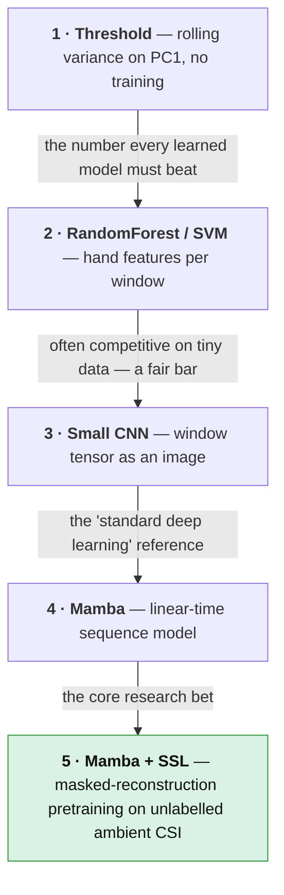
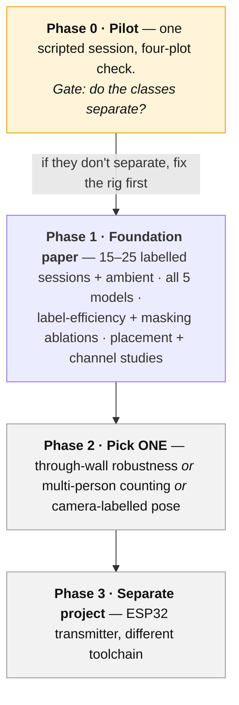

[Overview](index.md) · [Journey](journey.md) · [Installation](installation.md) · [CSI Fundamentals](csi_preprocessing.md) · [Data Collection](data-collection.md) · [Signal Characterization](visualization.md) · **Models & Roadmap** · [GitHub](https://github.com/ananyasahani/rpi-csi-pose-sensing)
{: .site-nav }

# Models & Roadmap

**What this covers / why it matters:** the progression of models from a
zero-training baseline to the headline Mamba + self-supervised system, and the
staged plan that keeps the project from sprawling. Each model earns the next — you
never reach for the big one until the small one has given you a number to beat.

## The model progression

1. **Threshold baseline (no training).** Rolling variance / z-score on the first
   principal component. Establishes that the classes are separable at all and
   gives the naive number every learned model must beat. Costs nothing; goes in
   the paper.
2. **Classical ML baseline.** Per-window hand features — per-subcarrier variance,
   low-band spectral energy, top PCA components — into a RandomForest or SVM. Fast,
   strong, honest, and often competitive with tiny data.
3. **CNN baseline.** A small 1D/2D CNN over the window tensor `(T, C)`. Treat the
   window as a (time × subcarrier) image: Conv → BN → ReLU stacks → global pool →
   linear head. Kept lightweight (~0.1–0.3 M parameters is legitimate here).
4. **Mamba (main model).** A Mamba sequence model over the window, time as the
   sequence axis and subcarriers as features. *Why Mamba:* linear-time sequence
   modelling for long CSI streams, cheaper than attention at these sequence
   lengths, with WiMamba as precedent.
5. **Mamba + self-supervised pretraining (headline).** Pretrain the Mamba backbone
   on unlabelled ambient CSI with a masked-reconstruction objective, then fine-tune
   a small classification head on the labelled sessions.

## Self-supervised pretraining — the core research bet

**Why:** labelled CSI is expensive; unlabelled ambient CSI is free. If pretraining
on the cheap data lets us fine-tune on little labelled data and still win, that is
the contribution. Precedent: WiFi-JEPA (masked-latent prediction beats
from-scratch), WiMamba (Mamba backbone pretrained on unlabelled CSI).

**Objective (masked reconstruction):** mask spans of the CSI window — time spans,
subcarrier bands, or both — and train the model to reconstruct the masked
positions from the visible ones, with MSE on the masked positions only. Masking
along **time** forces learning the channel's temporal structure; masking
**subcarriers** forces cross-frequency structure. Which helps most is an ablation.

**Sizing caution.** CSI datasets are tiny next to vision or text corpora, so SSL
can overfit a few thousand sequences. Start small (few Mamba blocks, modest hidden
size). Validate that pretraining actually helped with a **linear probe**: a linear
classifier on frozen pretrained features should beat one on random-init features.
If it doesn't, train supervised-only for now and revisit once more ambient hours
are collected.

## The experiments that make it a paper

| Experiment | What it shows |
|---|---|
| **Main results table** | All five models, accuracy / macro-F1 on the session-disjoint test set (`empty` / `still` / `walk`; optionally multi-person). |
| **SSL ablation** *(core)* | Mamba from-scratch vs pretrained. |
| **Label-efficiency curve** | Accuracy vs labelled-data fraction (10 / 25 / 50 / 100%), scratch vs pretrained. If pretraining helps most when labels are scarce, that's the money figure. |
| **Masking-strategy ablation** | Time vs subcarrier vs random masking. |
| **Cross-condition generalization** | Held-out day / held-out person; report the drop honestly. |

**Training practicalities.** Parsing, visualization and classical ML run on CPU;
use a Colab T4 only for CNN / Mamba training and SSL pretraining. AdamW, cosine
schedule, early stopping on a session-disjoint val split. Light temporal jitter
and Gaussian noise on amplitude for augmentation — never augmentations that break
channel structure. Metrics: accuracy + macro-F1, a confusion matrix per model,
and precision/recall for presence.

## Roadmap

- **Phase 0 — pilot (gate everything on this).** Bring up the rig, capture one
  scripted `empty` / `still` / `walk` session, run the four-plot visualization. If
  `empty` and `walk` don't visibly separate, fix placement / channel / traffic
  before collecting 20 sessions of unusable data.
- **Phase 1 — the foundation paper.** Commodity single-antenna WiFi CSI for
  presence + coarse activity, with self-supervised Mamba pretraining from
  unlabelled ambient data, evaluated with session-disjoint splits — plus the
  placement and channel studies. Achievable on a Pi + Colab T4.
- **Phase 2 — pick exactly one extension**, only after Phase 1 works. Through-wall
  robustness, multi-person counting, or camera-labelled pose. Each is defensible;
  all together is several years and several papers.
- **Phase 3 / separate project — ESP32 as transmitter.** Fewer subcarriers, a
  different toolchain and format. Distinct enough to stand alone; deliberately not
  blended into the Pi pipeline.

### Future work, parked (not part of Phase 1)

Pose estimation with camera labels, through-wall sensing, dual-geometry
inside/outside swaps, fine-grained multi-person counting, ESP32 constrained
hardware, per-setup architecture variants. Each is captured so it isn't lost;
the core staying small is a deliberate design choice.

## Confirmed results log

Empty until Phase 1 produces results. Every confirmed number is recorded — with
date and exact setup (model, split, data amount) — append-only in
[`context/06-execution-plan.md`](https://github.com/ananyasahani/rpi-csi-pose-sensing/blob/main/context/06-execution-plan.md).

---

*Model details:
[`context/05-deep-learning.md`](https://github.com/ananyasahani/rpi-csi-pose-sensing/blob/main/context/05-deep-learning.md).
Full phase plan and idea parking lot:
[`context/06-execution-plan.md`](https://github.com/ananyasahani/rpi-csi-pose-sensing/blob/main/context/06-execution-plan.md).*
