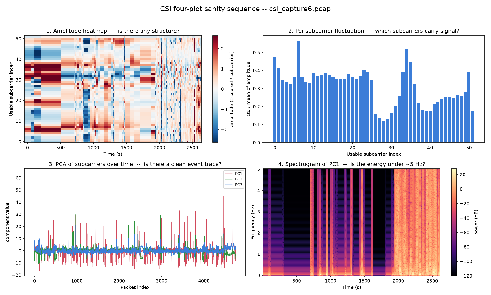
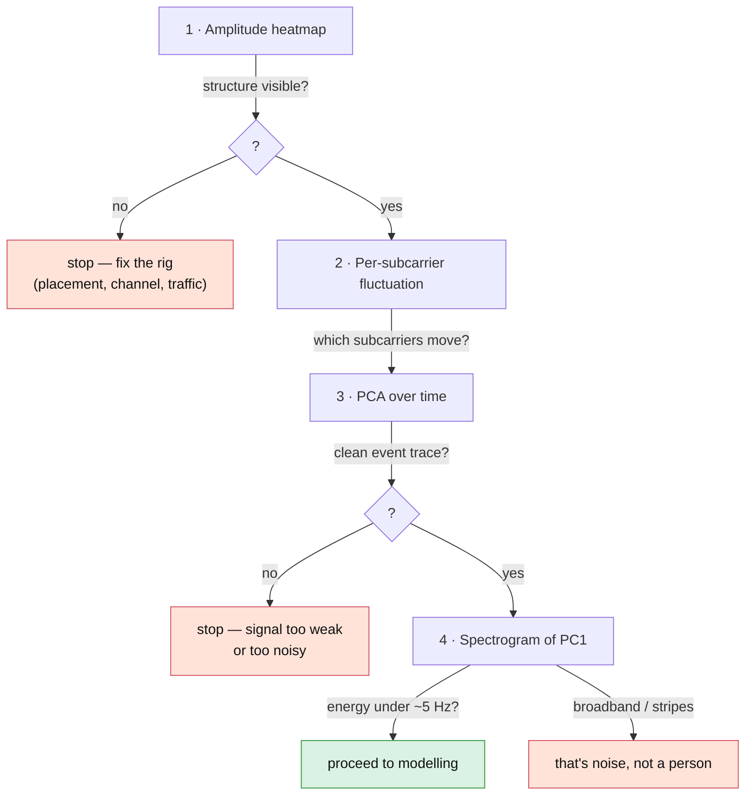

[Overview](index.md) · [Journey](journey.md) · [Installation](installation.md) · [CSI Fundamentals](csi_preprocessing.md) · [Data Collection](data-collection.md) · **Signal Characterization** · [Models & Roadmap](models.md) · [GitHub](https://github.com/ananyasahani/rpi-csi-pose-sensing)
{: .site-nav }

# Signal Characterization

**What this covers / why it matters:** how to *see* whether there is real,
separable signal in the CSI before committing to deep learning, and how to pull
early inferences out of it with no labels. Every plot here is a figure or a sanity
gate — it tells you whether to proceed, and it becomes supporting evidence later.

> **What this page is showing.** The figure below is generated from one of our own
> early captures (`csi_capture6.pcap`) — a long, bursty, roughly-sampled ambient
> recording, **not** a labelled Phase 0 session at the locked 10 Hz rate. So it
> demonstrates *the tooling and how to read these plots*, not class separability.
> Per-class figures — `empty` vs `still` vs `walk` side by side — come after the
> Phase 0 pilot. No accuracy or separability numbers are claimed here.

## The four-plot sanity sequence

Run these in order, per class, on the pilot capture. Each answers one question
before the next is worth looking at.

<figure>
  
  <figcaption>
    The four-plot sequence on <code>csi_capture6.pcap</code>, produced by
    <code>notebooks/four_plot_sequence.py</code>. Note the regime change around
    500 s, the busy middle section, and the degraded stretch on the right where
    the spectrogram energy spreads across all frequencies — broadband energy like
    that is noise, not motion.
  </figcaption>
</figure>

1. **Amplitude heatmap** (subcarrier × time). *Is there any structure at all?* An
   `empty` capture should look flat and quiet; `walk` should show bright bursts of
   variance.
2. **Per-subcarrier fluctuation** (std ÷ mean per subcarrier). *Which subcarriers
   carry signal?* Raw variance is dominated by frequency-selective fading, so
   normalise each subcarrier by its own level first. Flat-near-zero bars are
   dead / pilot leftovers to confirm-drop; the tall ones are where motion lives.
3. **PCA of the subcarrier dimension over time.** *Is there a clean event trace?*
   Reduce ~52 subcarriers to 2–3 components. Motion should show as clear spikes in
   PC1 / PC2; `empty` should be flat. PCA extracts the dominant motion-driven
   variance and suppresses noise.
4. **Spectrogram of PC1.** *Is the energy in the human-motion band?* Real motion
   sits under ~5 Hz (walking, gestures); breathing under ~0.5 Hz. Broadband energy
   or instantaneous full-spectrum stripes are noise or AGC, not a person.



## Telling a person from noise

Three discriminators separate a real body from a hardware artifact:

- **Temporal correlation.** A body persists across consecutive packets; noise
  decorrelates instantly. Autocorrelation of a moving segment decays slowly; noise
  drops to ~0 after one or two lags.
- **Frequency selectivity.** An AGC gain-step multiplies all subcarriers at once →
  a uniform jump across the cross-subcarrier correlation matrix. Real motion is
  frequency-selective → patchy, shifting correlation. A big uniform block is an
  artifact; textured or partial structure is real.
- **Low-frequency concentration.** Human-motion energy is under ~5 Hz on the
  spectrogram. Flat broadband energy with sharp vertical stripes is noise.

## What to expect with Tx and Rx in the same room

- The direct path dominates, so a body's reflection is a **small perturbation on a
  large stable baseline**. Don't expect huge relative swings — expect subtle
  textured disturbance on a steady baseline.
- Sensitivity depends on **where** the person is relative to the Tx–Rx line
  (Fresnel zones), not just whether they're in the room. Weak signal? Have someone
  cross the direct line before concluding the rig doesn't work.
- The `empty` baseline is **not** flat amplitude — static furniture creates a
  fixed multipath fingerprint. You're looking for *deviation from that fixed
  pattern over time*, not deviation from zero.

## UMAP for cluster inspection

UMAP on windowed features (variance, low-band spectral energy, top PCs, or a
model's embeddings) is excellent for *seeing* whether classes separate — better
than PCA for visualization.

> **Caveat, stated plainly.** UMAP is a *visualization / hypothesis* tool, not a
> classifier. Its distances and cluster sizes are **not** quantitatively
> meaningful. Do not claim "2 vs 3 people are separable" *because* UMAP shows
> blobs. Use UMAP to form the hypothesis, then prove it with a trained classifier
> and held-out accuracy.

```python
import umap
emb = umap.UMAP(n_neighbors=15, min_dist=0.1).fit_transform(features)  # (N, 2)
# scatter, coloured by label → eyeball class structure
```

## Label-free detectors

Useful on ambient captures and as early results — these form the baseline every
trained model has to beat:

- **PCA + variance thresholding** — the simplest detector: flag windows whose PC
  variance exceeds a baseline multiple as "something happened". Zero training.
- **Rolling z-score on PC1** — a lightweight presence detector; spikes above ~3σ
  are candidate events. Good first pass on unlabelled ambient data.
- **Change-point detection** — `ruptures` (PELT / BOCPD) on a rolling feature
  segments a long ambient stream into stable vs transitioning regions.
- **Clustering (k-means / GMM)** on windowed features — do clusters roughly split
  into quiet vs active? Validates structure before deep learning.
- **Autoencoder anomaly detection** — train a small AE to reconstruct
  mostly-ambient windows; high reconstruction error flags candidate presence. Same
  idea as the masked-reconstruction pretraining in the model plan, used directly
  as a detector.

## How these feed the paper

- Four-plot sequence → a "signal characterization" figure proving the modality
  works on this hardware.
- UMAP → a "class structure" figure motivating the classifier.
- Label-free detectors → a baseline the trained models must beat.

---

*Full method, including the person-vs-noise correlation analysis, is in
[`context/04-ml-visualization.md`](https://github.com/ananyasahani/rpi-csi-pose-sensing/blob/main/context/04-ml-visualization.md).
Regenerate the figure on any capture with
`python notebooks/four_plot_sequence.py <capture>.pcap`.*
